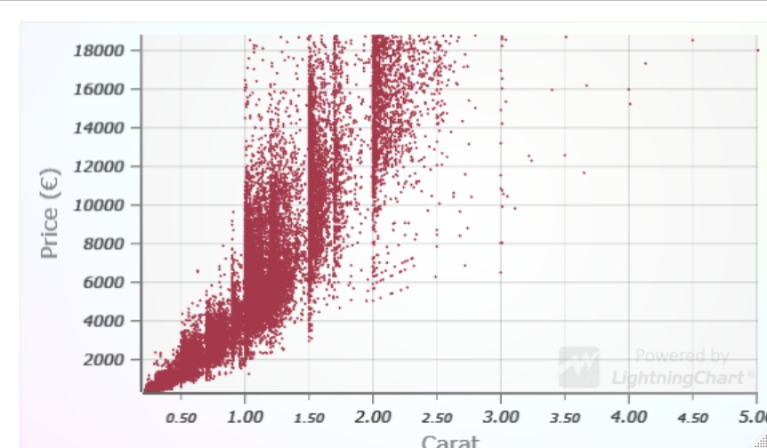
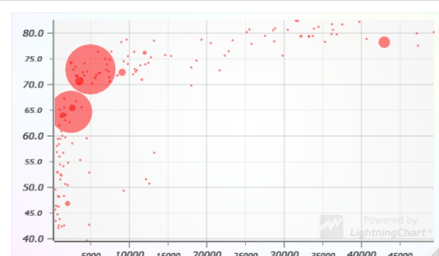
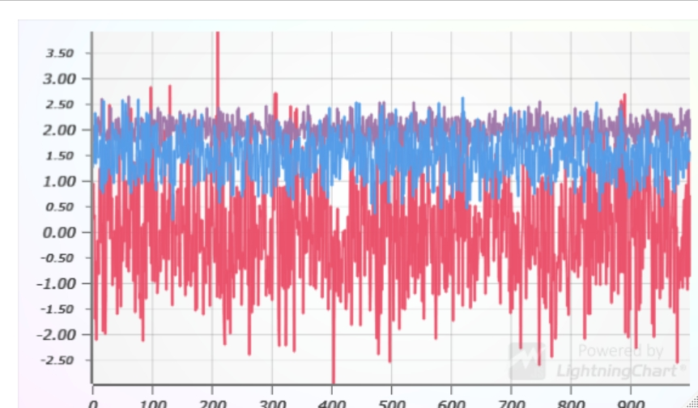
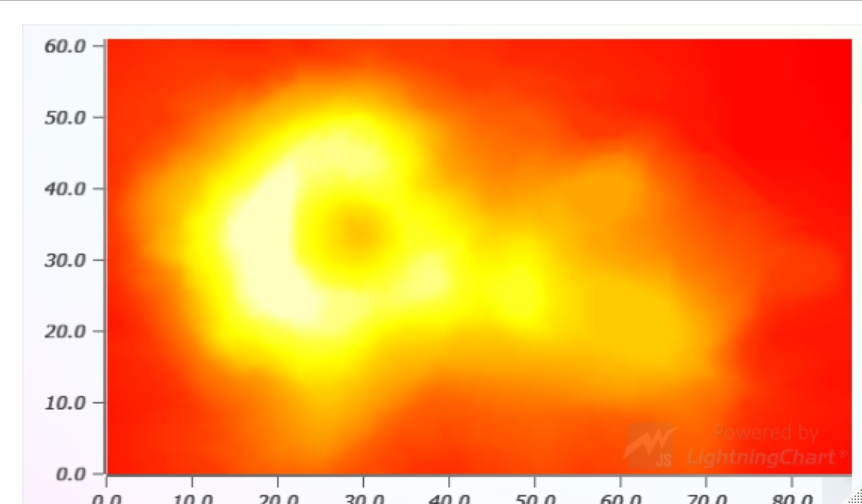

# Status

**This R package is currently in early stages of drafting**.

We are actively testing how different LightningChart JS features fit in the R ecosystem.

The package can be freely used or even customized. Feel free to create issues and pull requests if you have improvement suggestions.

Please note that LightningChart JS is not allowed to be used commercially without [purchasing a license](https://www.arction.com/lightningchart-js-pricing/).

# Features

**Scatter charts**

- Fully interactive (zooming, panning, data cursor)
- Up to **75 million** (75 000 000) data points
- `circle`, `square` and `triangle` markers
- Supports individual point sizes and transparent points





**Line charts**

- Fully interactive (zooming, panning, data cursor)
- Up to **500 million** (500 000 000) data points



**Heatmap charts**

- Fully interactive (zooming, panning, data cursor)
- Up to **1.2 billion** (1 200 000 000) data points
- Supports R color palettes (native, `RColorBrewer`, `Viridis`)
- Automatic bilinear color interpolation based on adjacent cell values



## About LightningChart JS

LightningChart JS is the proven performance leader in the field of JavaScript data visualization. We are changing the capabilities of web data visualization by providing **high-performance charts with real-time capabilities and optimized CPU usage**.

You can learn more about the product on our web site [lightningchart.com](https://www.arction.com/lightningchart-js/).

To see our charts in action, you can check our [Interactive Examples gallery](https://www.arction.com/lightningchart-js-interactive-examples/). At the time of writing we have a grand total of **112 different chart examples** covering a wide variety of fields and use cases, such as:

- Trading
- Research
- Medicine
- Statistics
- Business and Finance
- Geographical data visualization
- ...and a **stunning** amount of general data visualization examples that are not tied to any particular field.

# Installation and usage

The latest version of `lcjs4r` can be installed via R `devtools`.

If you don't have `devtools` installed, do that with the following command in R console:

```r
install.packages("devtools")
```

Install the latest `lcjs4r` version with following R console command:

```r
devtools::install_github("Arction/lcjs4r")
```

# Usage

**Example, basic scatter chart usage**

```r
library(lc4r)

lc4r(
    lcSeries(
        type = 'scatter',
        x = diamonds$carat,
        y = diamonds$price
    )
)
```

You can find more examples right here in [GitHub](./examples)

# Things to add

There are countless features in LightningChart JS that could be added into the R package. Here's some honorable mentions which we think would be especially interesting:

- Color palettes for line charts
- Color palettes for scatter charts
- 3D surface charts
- Threshold indicators
- Band indicators

# Contributing

Write here some instructions how the package can be developed, forked and contributed.
