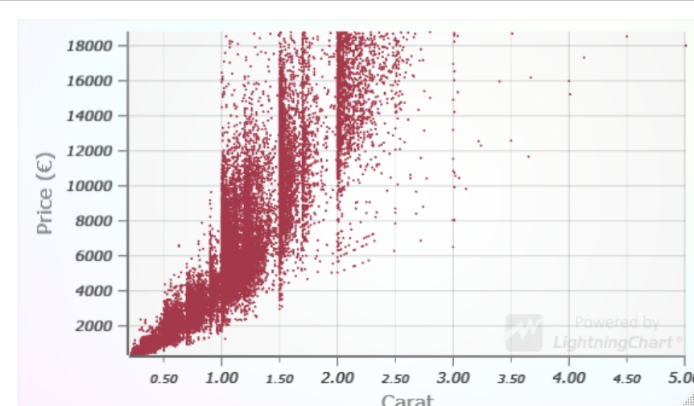
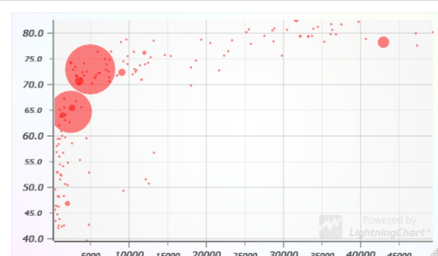
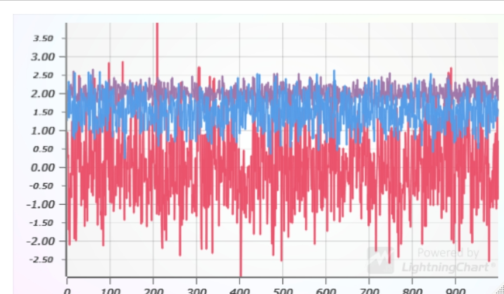
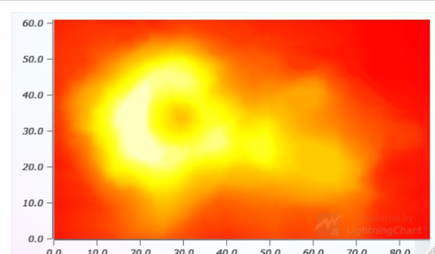
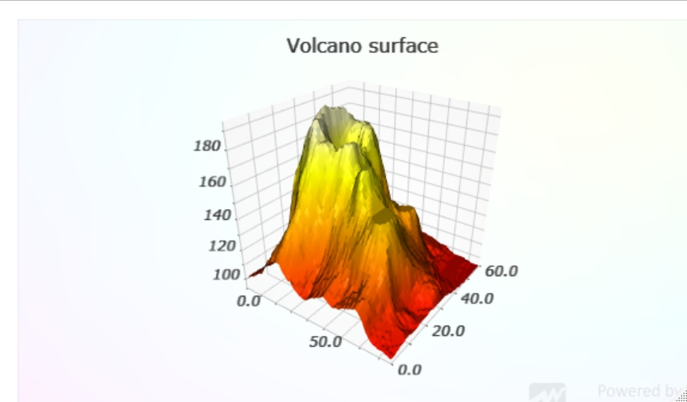
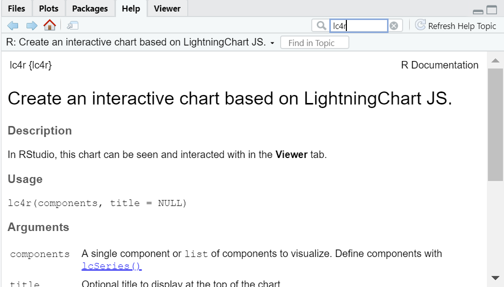

# Features

**Scatter charts**

- Fully interactive (zooming, panning, data cursor)
- Up to **75 million** (75 000 000) data points
- `circle`, `square` and `triangle` markers
- Supports individual point sizes and transparent points





**Line charts**

- Fully interactive (zooming, panning, data cursor)
- Up to **500 million** (500 000 000) data points



**Heatmap charts**

- Fully interactive (zooming, panning, data cursor)
- Up to **5.6 billion** (5 600 000 000) data points
- Supports R color palettes (native, `RColorBrewer`, `Viridis`)
- Automatic bilinear color interpolation based on adjacent cell values



**Surface charts**

- Fully interactive (zooming, panning, rotation)
- Up to **2 billion** (2 000 000 000) data points
- Supports R color palettes (native, `RColorBrewer`, `Viridis`)
  - Currently only coloring by Y but could be extended to color by separate data set
- Automatic bilinear color interpolation based on adjacent cell values
- Beautiful Phong shading for better depth perception



# Installation and usage

The latest version of `lc4r` can be installed via R `devtools`.

If you don't have `devtools` installed, do that with the following command in R console:

```r
install.packages("devtools")
```

Install the latest `lc4r` version with following R console command:

```r
devtools::install_github("Arction/lc4r")
```

# Usage

**Example, basic scatter chart usage**

```r
library(lc4r)

data <- mtcars[,c('wt','mpg')]
print(lc4r(lcSeries(
  type = 'scatter',
  x = data$wt,
  y = data$mpg
)))
```

You can find more example R scripts right here in [GitHub](./examples)

Apart from example scripts, the best place to learn about package usage is to view the package documentation in `RStudio`:



# About LightningChart JS

LightningChart JS is the proven performance leader in the field of JavaScript data visualization. We are changing the capabilities of web data visualization by providing **high-performance charts with real-time capabilities and optimized CPU usage**.

You can learn more about the product on our web site [lightningchart.com](https://www.arction.com/lightningchart-js/).

Please note that LightningChart JS is not allowed to be used commercially without [purchasing a license](https://www.arction.com/lightningchart-js-pricing/).

To see our charts in action, you can check our [Interactive Examples gallery](https://www.arction.com/lightningchart-js-interactive-examples/). At the time of writing we have a grand total of **112 different chart examples** covering a wide variety of fields and use cases, such as:

- Trading
- Research
- Medicine
- Statistics
- Business and Finance
- Geographical data visualization
- ...and a **stunning** amount of general data visualization examples that are not tied to any particular field.

# Things to add

There are countless features in LightningChart JS that could be added into the R package. Here's some honorable mentions which we think would be especially interesting:

- Color palettes for line charts
- Color palettes for scatter charts
- Threshold indicators
- Band indicators
- Area series
- Area Range series
- Candlestick series
- Polar charts

# Contributing

Anyone is welcome to contribute towards improving `lc4r` by

- Suggesting improvements, changes or new features by [creating an issue in GitHub](./readme/creating-issue.md)
- Taking the initiative and implementing an improvement in the package and [creating a pull request in GitHub](./readme/creating-pull-request.md)
